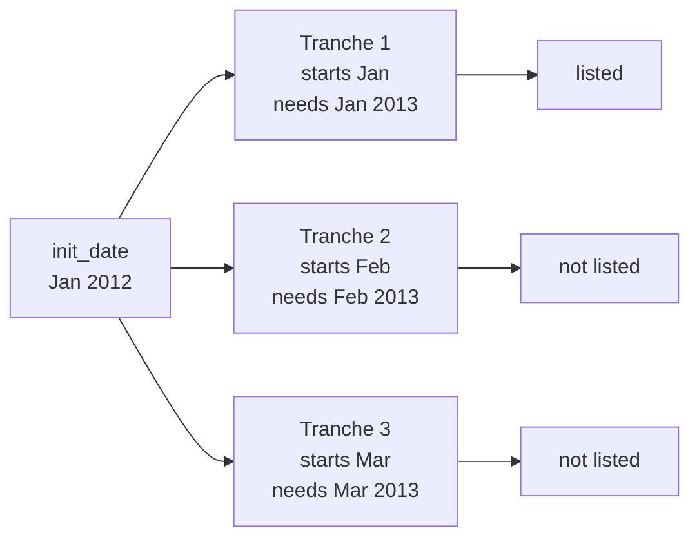

# Annual Option Tranching: Why It Is Blocked, and What Actually Works

**Scope:** the validation in `strategies/spec.py::OptionGroup.check_for_tranches` that raises
`Cannot use tranching if you are using annually expiring options`, why it exists, and what the
underlying listed-contract data says about when annual tranching is genuinely viable.

---

## TL;DR

- Listed options do **not** have a full set of monthly expiries at a 12-month horizon. Far-dated
  contracts thin out to quarterly + January.
- Tranching staggers each tranche into a different start month, and each tranche then buys an option
  expiring `roll_frequency` months after **its own** start. With `roll_frequency = 12`, most staggered
  tranches ask for a contract that was never listed.
- A production index failed this way in October 2025, so the configuration is now rejected at spec
  construction and at the IPA API layer.
- The guard is **blunt**: it bans every `roll_frequency == 12` + multi-tranche combination. Empirically
  two configurations on SPY *would* work — a 4-tranche ladder anchored to the March/June/September/December
  cycle, and a 2-tranche ladder anchored to Mar/Sep or Jun/Dec — and both are blocked today.

---

## 1. The guard

`python/merq/indices/merqube/options/strategies/spec.py`

```python
def check_for_tranches(self):
    ...
    expiry_calculator = self.rebalancer.expiry_calculator
    if not expiry_calculator.roll_frequency % self.number_of_tranches == 0:
        raise ValueError("The roll frequency of the rebalancer should be a multiple of the number of tranches")
    if (
        isinstance(expiry_calculator, MonthlyExpiryCalculator)
        and expiry_calculator.roll_frequency == 12
        and self.number_of_tranches != 1
    ):
        raise ValueError("Cannot use tranching if you are using annually expiring options")
```

The check inspects exactly three things: the calculator type, the roll frequency, and the tranche
count. **The underlier is not part of the condition.** Switching from TSLA to SPY, or to any other
name, does not change the outcome.

It is reached from the `validate_options` model validator, so it fires during `OptionGroup`
construction — and therefore also during IPA request validation, which returns:

```json
{
  "result": "INVALID",
  "errors": [{
    "type": "value_error",
    "loc": ["groups", 0],
    "msg": "Value error, Cannot use tranching if you are using annually expiring options"
  }]
}
```

Introduced in commit `bd08fe8c6`, PR [#8963](https://github.com/merqurian/dev/pull/8963), ticket PE-8350.

---

## 2. How tranching produces the problem

`OptionGroup.expand_for_tranches` builds the ladder in three steps:

1. Clone the expiry calculator with a **reduced** frequency — this is only the stagger step:

   ```python
   update={"roll_frequency": ...roll_frequency // self.number_of_tranches}
   ```

2. Walk `init_date` forward by that stagger, once per tranche.

3. Give each tranche a copy of the **original** rebalancer, changing only `init_date`. Each tranche
   therefore keeps `roll_frequency = 12`.

The consequence: tranche *i* starts `i × (12 / N)` months after the anchor and buys an option expiring
**12 months after its own start month**.



The pre-existing divisibility check (`roll_frequency % number_of_tranches == 0`) does not help:
`12 % 12 == 0` and `12 % 4 == 0` are both arithmetically valid. The constraint being violated is
market availability, not arithmetic.

---

## 3. The incident (2025-10-14)

Index `BMO_OPTS_2025_10_14_16_33`, TSLA underlier, `init_date = 2012-01-20`,
`roll_frequency = 12`, `number_of_tranches = 12`, `day_week` expiry (3rd Friday).

Daily calculation failed with:

```
MissingDataError: Couldn't fetch contracts on eff_date: 2012-02-17 for the requested filters:
option_type: PUT, start_expiry_date: 2013-02-15, end_expiry_date: 2013-02-17, standard_only: True
Ticker, Mics present in merq universe but couldn't find contracts in ivol: [('TSLA', 'XNAS')]
```

Expiries that actually existed for TSLA on 2012-02-17:

```
2012-02-18, 2012-03-17, 2012-06-16, 2012-09-22, 2013-01-19, 2014-01-18
```

Near-dated monthlies, mid-dated quarterlies, and January-only LEAPS. The February tranche needed a
February 2013 expiry, which was never listed. The next tranche (March) would have failed for the same
reason. Diagnosis at the time: an invalid index configuration, not a data gap and not a code bug —
hence a validation rather than a fix to the tranching logic.

---

## 4. Contract availability for SPY

SPY is the most liquid listed option in the world, so it is the best case. It is still not immune.

Query: for every third Friday from 2013 onward, does an expiry exist within ±7 days of that date plus
12 months? Source: `ivol.option_value` joined to `ivol.stock_symbol`, `standard_only` equivalent.

| Start month | 12-month expiry available | Verdict |
|---|---|---|
| January | 14/14 | available |
| February | 1/14 | unavailable |
| March | 14/14 | available |
| April | 0/9 | never |
| May | 0/14 | never |
| June | 13/13 | available |
| July | 1/14 | unavailable |
| August | 1/13 | unavailable |
| September | 13/13 | available |
| October | 1/13 | unavailable |
| November | 1/13 | unavailable |
| December | 13/13 | available |

*(April has fewer observations because the April third Friday is Good Friday in some years and the
market is closed.)*

**Only five start months support a 12-month roll on SPY: January, March, June, September, December.**

Illustrative — all expiries beyond 200 days as of 2013-02-20-era data (2015-02-20 shown):

```
2015-09-18, 2015-09-30, 2015-12-19, 2015-12-31, 2016-01-15,
2016-03-18, 2016-06-17, 2016-09-16, 2016-12-16, 2017-01-20, 2017-12-15
```

Quarterlies plus January. No February, April, May, July, August, October, or November.

### 4.1 Which tranche ladders survive

`number_of_tranches` must divide 12; the stagger is `12 / N` months. Mapping each tranche's start month
onto the available set `{Jan, Mar, Jun, Sep, Dec}`:

| Tranches | Stagger | Start months | Viable |
|---|---|---|---|
| 2 | 6 | Mar, Sep | yes |
| 2 | 6 | Jun, Dec | yes |
| 2 | 6 | Jan, Jul | no — July |
| 3 | 4 | any anchor | no |
| 4 | 3 | **Mar, Jun, Sep, Dec** | **yes** |
| 4 | 3 | Jan, Apr, Jul, Oct | no — Apr, Jul, Oct |
| 6 | 2 | any anchor | no |
| 12 | 1 | all months | no — the incident config |

A counter-intuitive result: **January is individually the best-covered month but cannot anchor any
multi-tranche ladder**, because Jan+3 = April, Jan+4 = May and Jan+6 = July are all empty. Anchoring an
"annual" strategy to January is the natural instinct — LEAPS convention — and it is exactly the
configuration that fails.

### 4.2 History constraint

The quarterly ladder only holds for recent history. Same test, quarterly third Fridays before 2013:

| Period | Mar | Jun | Sep | Dec |
|---|---|---|---|---|
| 2006–2009 | missing | missing | missing | available |
| 2010 | missing | available | missing | available |
| 2011 | available | available | available | available |
| 2012 | missing | available | available | available |
| 2013+ | available | available | available | available |

Before 2010 only December supported a 12-month horizon. **A four-tranche quarterly annual ladder on SPY
is only continuously supported from 2013 onward** — backtests starting earlier will hit missing
contracts regardless of the code guard.

---

## 5. Implications for a quarterly collar

For a strategy of the form *buy ATM puts, laddered in four quarterly tranches of one-year trades, with
short calls sold on a separate short cycle*:

- The four-tranche annual put ladder is **market-viable when anchored to March/June/September/December**.
  Continuously available for *all four* months from **2013** onward. Put-only, a **June 2012** anchor also
  works (Jun/Sep/Dec 2012 + Mar 2013); a **March 2012** anchor does not (Mar 2012→Mar 2013 missing).
- Set `init_date` to a third Friday in March, June, September, or December. `expand_for_tranches` will
  then produce exactly the quarterly ladder — one tranche expiring and rolling each quarter, the other
  three live and assessable.
- The short-call leg on a bi-weekly or monthly cycle belongs to a **separate `OptionGroup`** with its own
  rebalancer. That group has `roll_frequency != 12`, so this *annual* guard does not apply to it — but
  **weekly availability is a separate constraint**. As of mid-2012, SPY weeklies in IVol were still sparse
  (e.g. on 2012-06-29 the listed near call expiries were 2012-07-06, 2012-07-21, 2012-08-18 — no 2012-07-13).
  A bi-weekly call roll that targets every other Friday therefore fails in June 2012 even when the put
  ladder is fine. By early 2013 weeklies are dense enough for bi-weekly rolls. **A full collar with
  4× annual puts + bi-weekly short calls should start at 2013-03 (or later), not 2012-06.**

### Open question: put harvesting and re-strike tenor

An early-close-and-re-strike rule ("close the put and re-strike lower if ITM / appreciated 2x / >5 DTE")
interacts with everything above, and the answer depends on an unstated design choice:

- **Re-strike keeps the original expiry**, changing only the strike — safe. Strikes are dense at every
  listed expiry, so no availability problem is introduced.
- **Re-strike resets to a fresh 12-month tenor** — unsafe. A harvest triggered in, say, February would
  require a February+12 expiry, which does not exist. The tranche would silently drift off the quarterly
  cycle the first time it harvests, and fail on the next roll.

If the intent is the second, the re-strike must snap to the nearest **quarterly** expiry rather than to
"today plus twelve months", otherwise the ladder degrades into the failure mode this document describes.

---

## 6. Options for changing the guard

The guard is correct for the majority of configurations and wrong for a narrow, well-defined set.
Three ways forward, in increasing order of effort:

1. **Delete the check.** Unblocks local backtesting immediately. Not appropriate for a shared branch:
   it re-opens the January-anchored and 12-tranche configurations that genuinely have no contracts,
   which is the exact production failure it was added to prevent.

2. **Narrow the check** (recommended). `init_date`, the stagger, and the tranche count are all known at
   validation time, so the tranche start months can be computed without any data access. Reject only when
   a start month falls outside the quarterly cycle. This keeps the incident configuration blocked while
   permitting the quarterly ladder.

3. **Validate against actual contract availability.** The most correct and the most invasive — spec
   validation is a Pydantic `model_validator` and should not be performing database lookups. Would need
   to move to a separate pre-flight check.

Any relaxation should be raised with the PE-8350 author before being merged, since the guard is also
deployed at the IPA layer and the UI has a matching restriction on its roadmap.

---

## Reproducing the data

```python
from merq.merq_platform.impl.services.options.db_util import get_options_database_connector
import pandas as pd

c = get_options_database_connector()
with c.connect() as conn:
    df = pd.read_sql("""
        SELECT ov.t_date, ov.expiration_date
        FROM ivol.stock_symbol ss
        JOIN ivol.option_value ov ON ov.stock_id = ss.stock_id
        WHERE ss.symbol = 'SPY' AND ov.t_date >= '2013-01-01'
          AND EXTRACT(DAY FROM ov.t_date) BETWEEN 14 AND 20
          AND EXTRACT(DOW FROM ov.t_date) = 5
        GROUP BY ov.t_date, ov.expiration_date
    """, conn, parse_dates=['t_date', 'expiration_date'])

for d, g in df.groupby('t_date'):
    tgt = d + pd.DateOffset(months=12)
    hit = ((g.expiration_date >= tgt - pd.Timedelta(days=7))
           & (g.expiration_date <= tgt + pd.Timedelta(days=7))).any()
```

Swap the symbol to check another underlier. Coverage for single stocks is materially worse than SPY.
