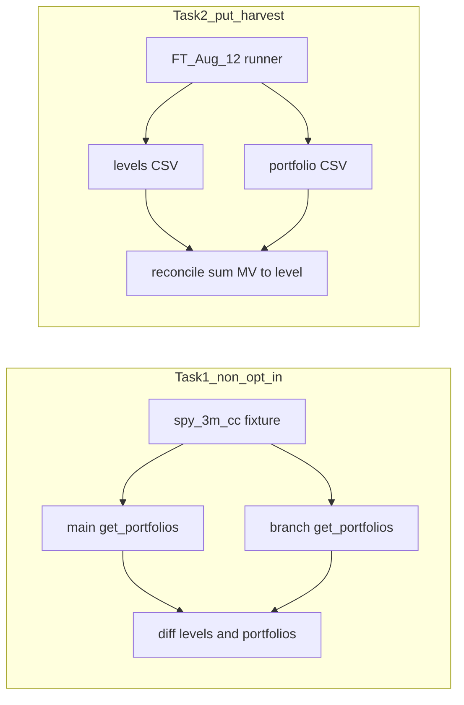

# Avery PR 10780 listed-option regressions

## Where the latest code is

| Checkout | Path | State |
|---|---|---|
| This Cursor workspace | `/Users/luomengzhou/Projects/dev` | `main` — **no** put-harvest PR code |
| PR worktree | `/Users/luomengzhou/Projects/dev-put-harvesting` | `luomeng/put-harvesting` at feature commit `0584edc03`; remote tip is `1cd61ed21` (merge main into branch only) |

**Decision:** run everything in [`/Users/luomengzhou/Projects/dev-put-harvesting`](/Users/luomengzhou/Projects/dev-put-harvesting). Fast-forward that worktree to `1cd61ed21` first. Local-only FT runner files (`FT_Aug_12`, `ft_aug_12_backtest.py`, `backtest_cache.py`) stay gitignored via `.git/info/exclude` — do **not** add them or Aug 12 CSVs to the PR.

This workspace’s open [`spec.py`](python/merq/indices/merqube/options/strategies/spec.py) is the pre-PR `main` copy (missing `allow_annual_multi_tranche`); ignore it for these runs.

## Avery’s asks → concrete runs



### Task 1 — Existing listed-option index (no PUT_HARVEST)

**Index:** integration fixture `spy_3m_cc` / `CARTER_SPY_DEMO_SAMPLE` from [`spec_fixtures.py`](../dev-put-harvesting/python/tests/integration/indices/merqube/options/merq_option_strategies/spec_fixtures.py) via [`test_spy_3m_cc`](../dev-put-harvesting/python/tests/integration/indices/merqube/options/merq_option_strategies/test_merqube_option_index.py).

**Why:** real listed covered-call already in-repo; ends `2024-10-01`; no `PUT_HARVEST` / `RESTRIKE_AT_MARKET` / `allow_annual_multi_tranche`. Also run `test_early_exercise` (legacy early-rebalance path, not put-harvest) as a second non-opt-in path.

**Baseline method:** same `get_portfolios` on **this `main` checkout** and on the **put-harvesting worktree**, dump levels + close portfolios, compare. Expect bitwise / near-zero float diffs.

**Env:** leave `MERQ_ENV` unset (production read-only). Do **not** set `MERQ_ENV=integration`. Do **not** use the earlier cache-miss-strict wrapper that failed on Aug 21. Mapping proxy currently answers on `db1-proxy:3306`.

Exact commands (after `cd …/python`, `export PYTHONPATH="$PWD"`):

```bash
# On branch worktree — assert existing fixtures still pass
poetry run python - <<'PY'
from tests.integration.indices.merqube.options.merq_option_strategies.test_merqube_option_index import (
    test_spy_3m_cc, test_early_exercise,
)
test_spy_3m_cc(); print("PASS spy_3m_cc")
test_early_exercise(); print("PASS early_exercise")
PY

# Dump levels/portfolios on main vs branch for numeric diff
# (same create_multi_asset_index + get_portfolios(end=2024-10-01) on both checkouts;
#  write CSVs under ft_aug_12_out/regression_YYYYMMDD/ and compare)
```

Optional harder check if CodeCommit + mapping stay up: short `OBUS0FM4` recompute via `get_index_objects_from_names` vs published `price_return` (prior Aug 21 attempt failed on mapping timeout; retry only if Task 1 fixture path already works).

### Task 2 — Put-harvest case level + portfolio

**Case:** local `FT_Aug_12` / `SPYCollarHarvest` via [`ft_aug_12_backtest.py`](../dev-put-harvesting/python/merq/indices/merqube/options/strategies/ft_aug_12_backtest.py) (not in PR).

```bash
cd /Users/luomengzhou/Projects/dev-put-harvesting/python
export PYTHONPATH="$PWD"
poetry run python merq/indices/merqube/options/strategies/ft_aug_12_backtest.py \
  --out ~/Projects/dev-put-harvesting/ft_aug_12_out/rerun_avery \
  --cache ~/.merq_backtest_cache
```

Then:

1. Compare new levels/portfolio CSVs to prior baselines in [`ft_aug_12_out/`](../dev-put-harvesting/ft_aug_12_out/) / `rerun_after_pr/` (Aug 21 already reported identical harvest CSVs and `max |sum(MV)-level| = 9.09e-13`).
2. Report the runner’s built-in reconciliation (`reconcile_to_levels`).
3. Do **not** `git add` those CSVs or the runner into PR 10780.

## Deliverable (reply-ready report)

- Which existing index and why (`spy_3m_cc` ± `early_exercise`; OBUS0FM4 only if run)
- Exact commands
- main vs branch match / any diffs + whether expected
- Put-harvest level↔portfolio consistency + vs prior CSV baseline
- Anything blocked (secrets, CodeCommit, VPN, cache)

## Out of scope

- No new prod index / no inventing a listed-option config
- No committing Aug 12 FT artifacts
- Unit pytest already green — not a substitute for the above
- No PR comment/push unless you ask after the report
